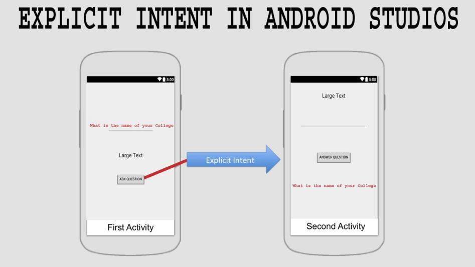

# **Mobile Infrastructure**

### **Android Startup Process** ###

.png>)

### **Android Security Model** ###

- **Sandboxing:** Android OS running application in Sandbox so application cannot interfere other Application Process nor data until permission granted. In Unix based model there is user ID consist in group, so if user allow permission it is also added in permission group ID.
- **Secure Inter-Process Communication:** IPC allows clients and server to exchange data across address such as intent, network.
- **Application Signing:** Android reject install of unsigned so application must be signed by self certificate.
- **Permission Modal:** If developer want any permission it should be define in Manifest.xml. to check granted group permission: #pm list permission -g

&#x20;           **Normal:** Permissions which cannot be  a threat to user privacy or sensitive information such  as internet, vibrate device are falls under normal permissions.

&#x20;           **Dangerous:** Permissions which could be a threat to user policy or data such as camera, location are falls under Dangerous permission. user must be allow this before app access any kind of data.

&#x20;          **Signature:** Sytem grant permissions to requesting only if it match the signature.

&#x20;          **singnatureOrSignature:** System grant the permission to requesting app either the app should system app or it should match the Signature.

### **Android File System and Data Structure**

- **Shared preferences:** Shared preferences are XML files used to store non-sensitive preferences of an app as a key-value pair, usually of type boolean , float , int , long , and string .

- **SQLite databases:** SQLite databases are lightweight file-based databases that are commonly used in mobile environments. The SQLite framework is supported by Android too and so you can often find apps that use SQLite databases for their storage needs.

- **Internal storage:** Internal storage, also known as the device's internal storage, is used to save files to the internal storage. It provides a fast response to memory access requests due to its direct access and almost the entire app related data is used here, logically it's a hard disk of the phone. Each app creates its own directory during installation under /data/data/\<app package name>/, it is private to that application and other applications don't have access to this directory. This directory is cleared when the user uninstalls the application.

- **External storage:** External storage is a world writable and readable storage mechanism in Android which is used to store files. Any app can access this storage to read and write files, because of these reasons, sensitive files shouldn't be stored here.

## **Android Application Component** ##

### **Activities, Services, Broadcast Receiver, Intents etc.** ###

* **Activities:** Activities is the visual screen which is interact with the User, it may contain button, TextView or many visual components.
* **Services:** Android component which running in background like downloading file over HTTP, Playing Music as so on. These not visible but play an important role for an android.
* **Broadcast Receiver:** It's listen broadcasted incoming message, the notification and receiving OTP and proceed is the suitable example of the BR.
* **Intents:** These are the components which re-used to bind two or more different Android components together.
* **Content Provider:** Content Provider handle the data related operations in android system.&#x20;



### **Application APK Structure** ###

* **Classes.dex:** It's compressed Dalvik Executable file (.dex) contain Java source code file.
* **AndroidManifest.xml:** It's most important file in android that contain all the defined permission for the app.
* **META-INF (dir):** Contain Certificate and Identifiable Information.
* **resources.arsc:** Contains simple values, like integers, Booleans and strings, as well as references to more complex resources, like UI layouts which are stored in separate binary XML files.
* **res (dir):** Contain Non-complied resources like images audio.
* **assets:** ability to put external images, html files, JavaScript files.
* **lib:** contain Library file contain Java Library for support to Android apk.

### **Application Signing and Google Bouncer** ###

If we decompile the application and recompile it again, we should be Signing with valid certificate else application will not be running.

Android app are self-Signed, Private Key of the certificate stays with the developer and Public Key will leave on internet.

There are two mode of Signing android App:

1. **Debug Mode:** Whenever the app using for debugging purposes when writing the code in Eclipse or Android Studio IDE and want run the application to the Emulator so application must be signed with Debug Mode.
2. **Release Mode:** Before application published in to playstore or publicly we need to sign the application with Self Certificate.

### **Signing Apps for Android:** ###

Signing application in Release Mode done in few methods:

1. Create a Keystore to store your Private Key
2. Create a Private key using keytool  
   ```
   #keytool -genkey -v -keystore [nameofkeystore] -alias [your_keyalias] -keyalg RSA -keysize 2048 -validity [numberofdays]
   ```
3. Sign the application using the Private Key by Jarsigner  
   ```
   #jarsigner -verbose -sigalg MD5withRSA -digestalg SHA1 -keystore {name of keystore} {apk file that have to sign} {your key alia}
   ```
4. Verify that the app is signed  
   ```
   jarsigner -verify -verbose {apk file name}
   ```
5. Align the APK package using zipalign  
   ```
   zipalign -v 4 your_project_name.apk
   ```

### **Verify app signature and Extracting Signature Authority** ###

It's using when application is suspected like vulnerable or build with malware so simply there's few files that are identified

```
MANIFEST.MF - Declares the resources
CERT.RSA - Public Key Certificate
CERT.SF - App Signature Information
```

To check the information simply unzip the apk file and use keytool:

```
#keytool -printcert -file META-INF/CERT.RSA
```

Signature of the file:

```
#cat META-INF/CERT.SF
```
