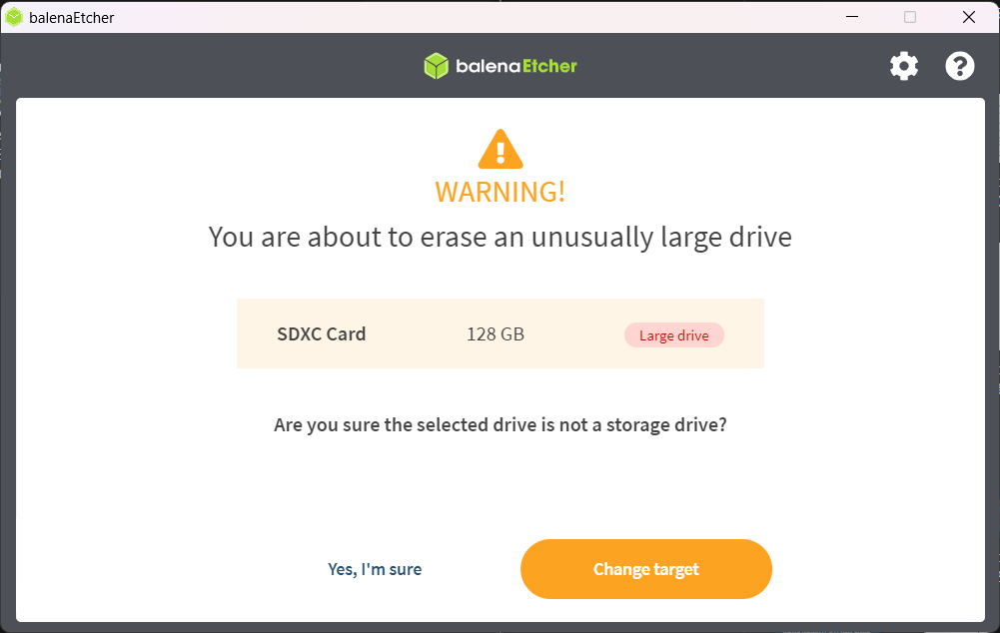
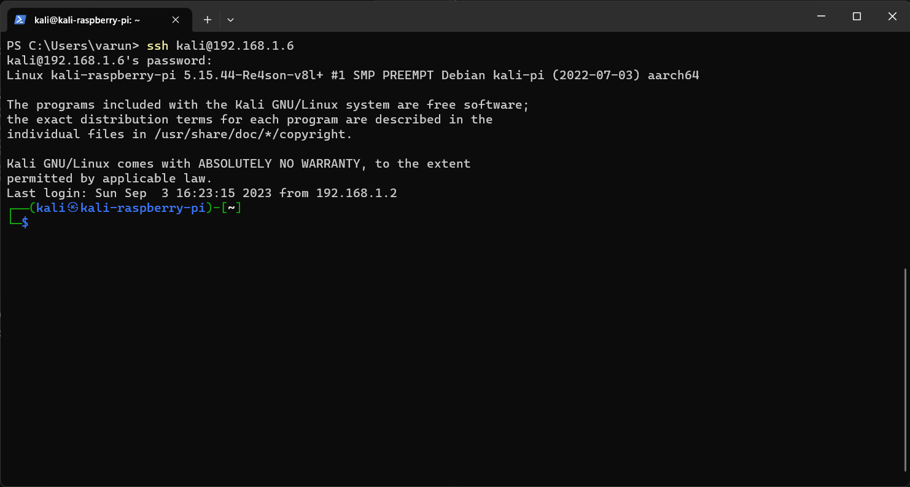

# **Portable Hacking Machine**

## **What is portable hacking machine ?**

A portable hacking machine is a small computer, such as a Raspberry Pi, loaded with various hacking tools and software. It allows hackers and pentesters to quickly set up a secure testing environment and execute various security tests. Portable hacking machines are particularly useful for situations where a traditional desktop or laptop computer may not be practical or available, such as in remote locations with limited internet connectivity. These machines are also useful for maintaining anonymity as it is more difficult to trace the source of an attack. However, one disadvantage of using a portable hacking machine is limited processing power and storage capacity. Despite some limitations, a portable hacking machine is an essential tool for hackers and pentesters who need to perform security testing on the go.

## **Why hackers/pentesters use portable hacking machine?**

Hackers and pentesters use portable hacking machines to conduct security testing on computer systems while on the move. This is especially useful when they need to perform security tests in remote locations, such as in areas where internet connectivity is limited. A portable hacking machine typically consists of a small computer, such as a Raspberry Pi, loaded with various hacking tools and software. It allows hackers and pentesters to quickly set up a secure testing environment and execute various security tests.

Hackers and penetration testers use portable hacking machines for several reasons:

1. **Mobility:** Portable hacking machines, often built on devices like Raspberry Pi or laptops, allow hackers and pentesters to carry out their work on the go. They can easily move from one location to another, making it convenient for field testing or engagements that require physical presence.
2. **Stealth and Anonymity:** Portable machines can be small and inconspicuous, which makes it easier to blend into different environments. This level of stealth can be useful for conducting security assessments without attracting unnecessary attention.
3. **Remote Access:** Portable hacking machines can be set up to establish remote access to target networks or systems. This enables hackers and pentesters to launch attacks and assessments from a safe location, reducing the risk of detection or physical compromise.
4. **Hardware Customization:** Building a portable hacking machine allows for hardware customization. Users can select specific components and configurations tailored to their needs, such as wireless adapters for Wi-Fi hacking or additional storage for data collection.
5. **Dedicated Purpose:** A portable hacking machine can be dedicated solely to security testing and offensive operations, reducing the risk of exposing personal or critical systems to potential threats.
6. **Quick Deployment:** Having a pre-configured, portable machine ready to go can save time when responding to security incidents or conducting time-sensitive assessments. It eliminates the need to set up an environment from scratch each time.
7. **Separation from Personal Systems:** Keeping hacking activities on a separate, isolated device helps protect personal or corporate systems from potential compromise and legal issues.
8. **Legal and Ethical Considerations:** Ethical hackers and penetration testers must operate within legal and ethical boundaries. Using a designated portable hacking machine helps maintain a clear separation between legitimate security assessments and illegal activities.

## **Creating your own portable hacking machine using Raspberry Pi**

### **What you'll need**

1. Raspberry Pi (compatible models include Raspberry Pi 4, 3, 2, and Zero).
2. MicroSD card (16GB or larger is recommended).
3. MicroSD card reader.
4. Ethernet cable.
5. Power supply for the Raspberry Pi.
6. HDMI cable and display (for initial setup).
7. USB keyboard and mouse (for initial setup).

### **Procedure**

**Download Kali Linux Image:**

* Visit the official Kali Linux downloads page ([https://www.kali.org/get-kali/#kali-arm](https://www.kali.org/get-kali/#kali-arm)) and select the appropriate image for your Raspberry Pi model. Download the image file (usually in .img.gz format).

**Note:** In this example I will download raspberry pi (64-bit) image. Why 64-bit image because some tools might not work in 32-bit properly as _BurpSuite. S_o I will be using 64-bit image in this example.


**Download balenaEtcher:**

Use Etcher ([https://etcher.balena.io/](https://etcher.balena.io/)) to write the Kali Linux image to the MicroSD card. Select the image you downloaded and the MicroSD card as the target.


**Note:** I am using balenaEtcher but you can also use raspberry pi [imager](https://www.raspberrypi.com/software/) or [rufus](https://rufus.ie/en/) in order to flash image to micro SD card.

**Flashing image:**

1\. Open Etcher


2\. Click on “Flash from file” and select the kali linux image you downloaded previously.


3\. Connect your SD card to your system then click on “Select target” and select you micro SD card carefully.

**Note:** All the data in your SD card will be erased so please take the backup of SD card already.


It will give warning if you are using micro SD card higher than 64 GB. Click on “Yes, I’m Sure”.



4\. Then click on “Flash” and sit back relax until it completes the flashing of image to you SD card. Time depends on SD card write speed.


**Tip:** Use high speed SD card to get high flash speed and high system performs on raspberry pi.

It will also validate the flash so let that happen or you can skip it by clicking on “skip”.


5\. After it done flashing quite the balenaEtcher and remove your micro SD card from system.


From here you have two ways:

1. Connect raspberry pi monitory, mouse and keyboard and start using it.
2. You can connect it to only ethernet cable and power supply and access it remotely.

As this article is about portable hacking machine so I will do it using second way. Don’t worry you will not always need to connect it to ethernet to work. Once you connect raspberry pi to ethernet then we will connect it to a wireless access point to control it wirelessly as given above.

#### **Find the raspberry pi in network**

You can do this by various tools like [advanced IP scanner](https://www.advanced-ip-scanner.com/) for windows or use nmap/netdiscover in linux or macOS.

I will suggest the simple way. Just go to your router dashboard and see the connected devices and get the IP.


As you see I got mine easily.

#### **Connect to raspberry pi using SSH**

Open the windows terminal and type `ssh kali@raspberrypi-ip` and hit enter.


Type “yes” and enter.


Now you will need to enter the password. The default **password** is “**kali**” and hit enter.



Then first update and upgrade your machine by using the command 

```bash
sudo apt update && sudo apt upgrade -y
```


After that run command `sudo kalipi-config`. A window will open.


Then select “Network Options → Wi-Fi” It will show nearby Wi-Fi access points. (You can navigate using arrow keys in it)


Then hit enter. Then you will need to enter SSID (Wi-Fi name) and then password to connect that Wi-Fi.

Then you will be back to main window. Then navigate to **finish** by using arrow keys and hit enter.


You will be connected to Wi-Fi. Now next time you don’t need to connect ethernet cable to raspberry pi it will automatically connected to your Wi-Fi.

Finally we are done with setting up raspberry pi portable hacking machine.

**Note:** Don’t forget to change the default the password of your user. You can change it by running command “passwd" then enter old password and then new password (you might not see the password while typing for security reasons).

## **Pros and cons of portable hacking machine**

**Pros:**

1. **Mobility:** Portable hacking machines, often built on compact platforms like Raspberry Pi, offer mobility and flexibility for conducting security assessments in diverse environments.
2. **Customization:** Users can tailor portable hacking machines to their specific needs, selecting hardware components and software tools to suit their ethical hacking objectives.
3. **Isolation:** Keeping hacking activities on a dedicated, isolated device helps protect personal or critical systems from potential compromise.Quick
4. **Deployment:** Pre-configured portable machines can save time during incident response or time-sensitive security assessments, eliminating the need to set up an environment from scratch.
5. **Legal and Ethical Boundary:** A portable hacking machine can be used to reinforce the importance of conducting ethical hacking within legal and ethical boundaries.

**Cons:**

1. **Legal and Ethical Concerns:** Misuse of portable hacking machines can lead to legal consequences and ethical dilemmas if used for unauthorized and malicious purposes.
2. **Complexity:** Setting up and configuring a portable hacking machine can be complex, requiring technical expertise and knowledge of ethical hacking tools.
3. **Cost:** Building a capable portable hacking machine with advanced hardware components can be expensive, especially when considering additional accessories and tools.
4. **Risk of Detection:** Even discreet devices are not entirely immune to detection, and if discovered, they could lead to suspicion or security alerts.
5. **Maintenance:** Portable hacking machines may require ongoing maintenance and updates to ensure that tools and software remain current and effective.

## **Summary**

In summary, we explored the world of portable hacking machines, which are small, versatile devices like Raspberry Pi used by ethical hackers to test and improve computer security. These devices have the advantage of being portable, allowing testers to move around easily. They can be customized to fit specific needs and save time during security checks. However, misusing them can lead to legal and ethical issues, and setting them up can be complicated and costly. It's crucial to use these tools responsibly, following the law and ethical guidelines, to ensure they do more good than harm in the world of cybersecurity.
