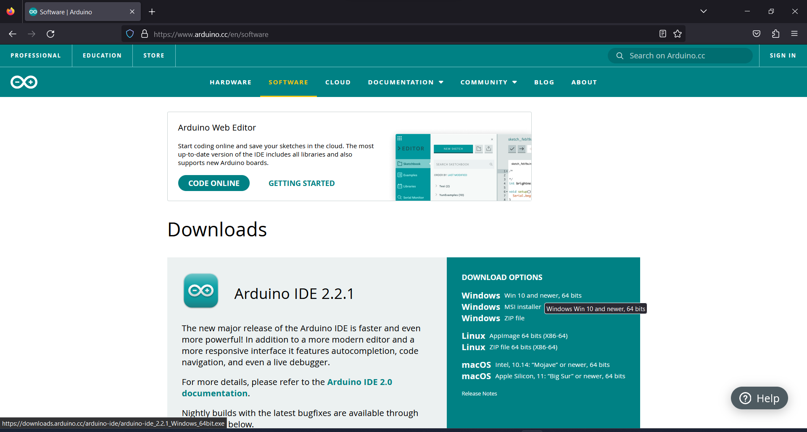
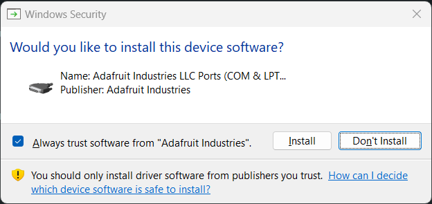
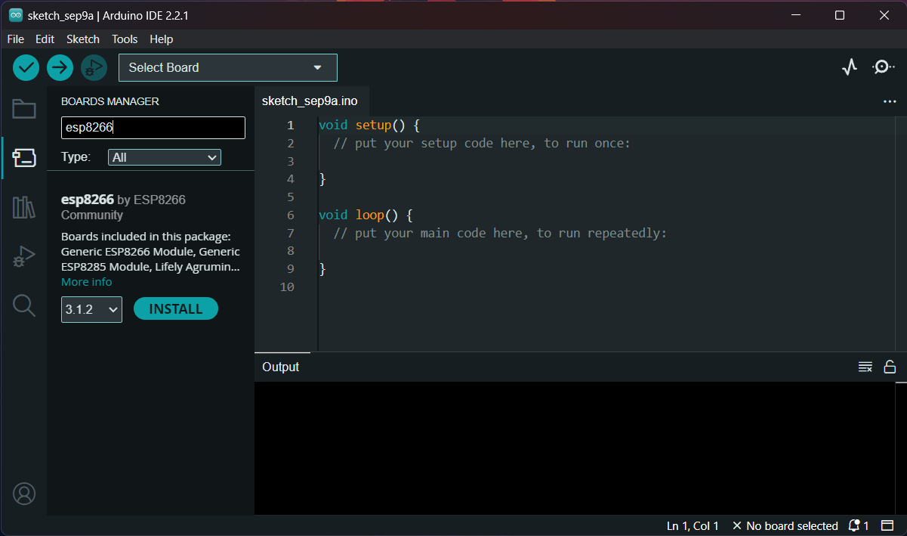
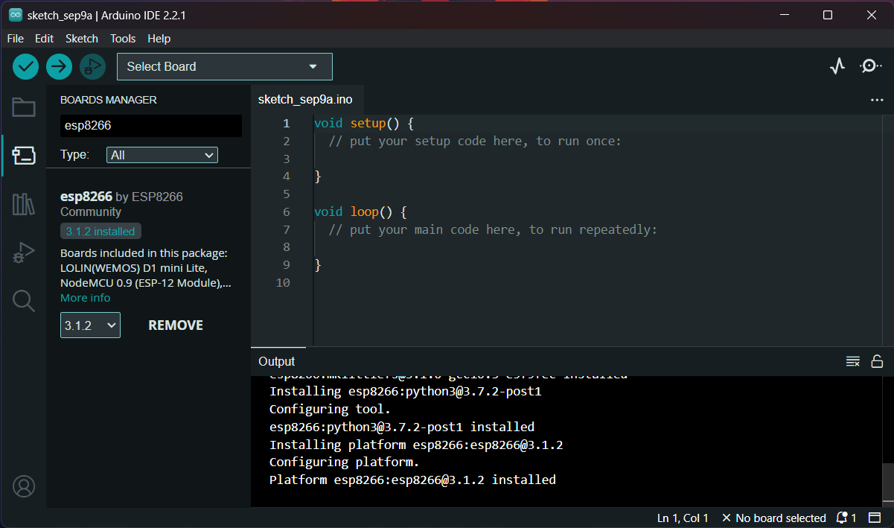
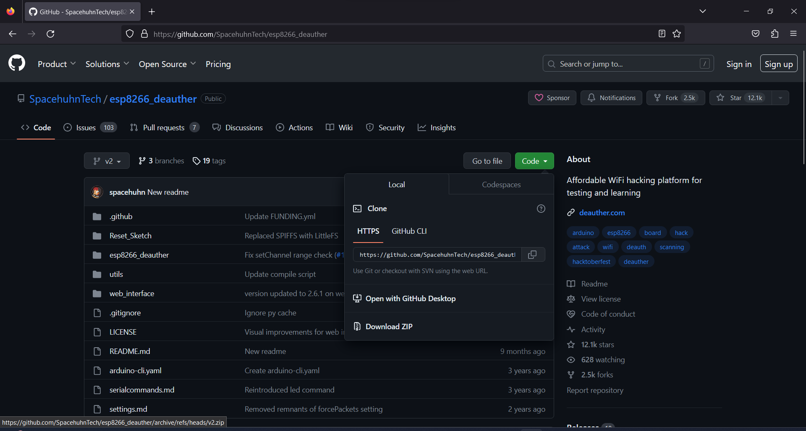
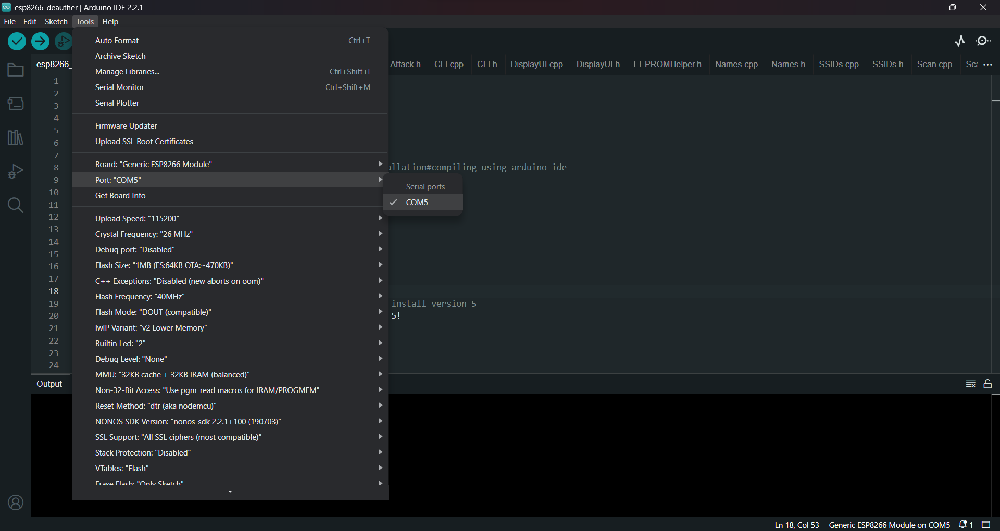
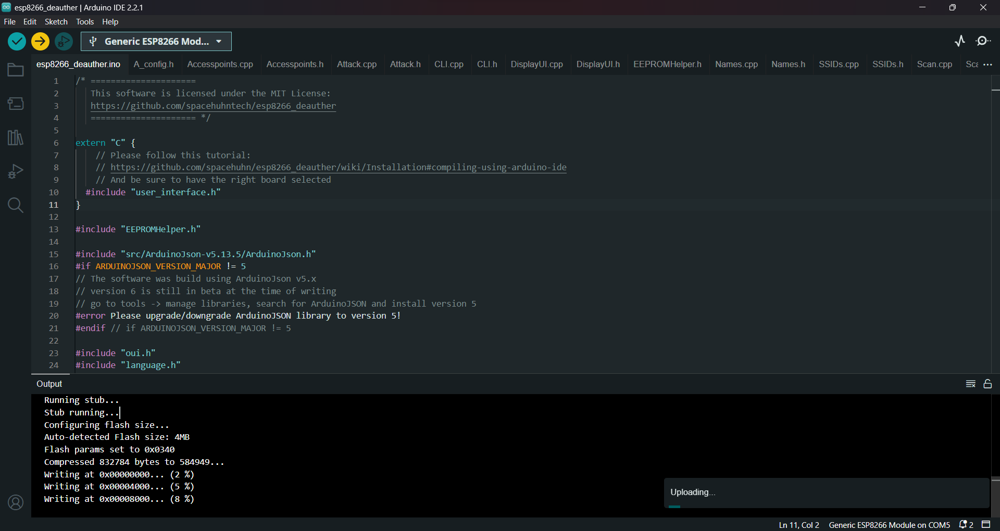
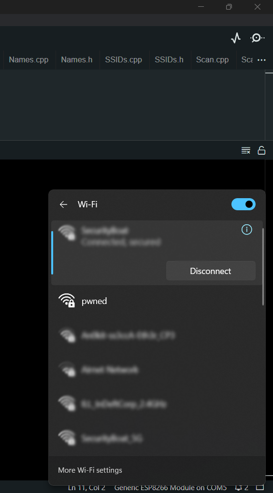

# **Wi-Fi Deauther**

**Table of Contents**

1. What is Wi-Fi deauther?
2. Why hackers use deauther?
3. Difference between Wi-Fi jammer and Wi-Fi deauther.
4. How make your own Wi-Fi deauther using NodeMCU (esp8266).
5. Summary.

### **What is Wi-Fi Deauther? **

A Wi-Fi deauther is a device that sends packets to a Wi-Fi access point or router with the intention of disconnecting all the connected devices from the network. This is achieved by sending deauthentication frames to the access point, which in turn sends them to the connected devices, forcing them to disconnect from the network.

Wi-Fi deauthers are commonly used by security researchers to test the security of Wi-Fi networks, as well as by hackers to carry out malicious attacks on Wi-Fi networks.

#### **Why hackers use deauthers? **

Hackers use deauthers to carry out denial-of-service (DoS) attacks on Wi-Fi networks. By sending deauthentication frames to an access point, hackers can force all devices connected to the network to disconnect and prevent them from reconnecting. This can be used as a disruptive tactic to cause chaos or as a way to gain unauthorized access to the network once all devices have been disconnected. Hackers can also use deauthers as a way to gather information about a network. By sending deauthentication frames to a device on the network, the device will automatically attempt to reconnect to the network, revealing its MAC address and other information. This can be useful for hackers to gather information about the devices and potentially exploit vulnerabilities in them.

It is important to note that using a deauther to carry out malicious attacks on Wi-Fi networks is illegal and can result in severe consequences, including fines and imprisonment. Therefore, it is important to use Wi-Fi deauthers only for legitimate security testing purposes and with the permission of the network owner.

#### **Difference between Wi-Fi jammer and Wi-Fi deauther. **

A WiFi deauther and a WiFi jammer are both devices used to disrupt wireless communication, but they serve different purposes and operate in distinct ways:

1. WiFi Deauther:
   * Purpose: A WiFi deauther is designed to deauthenticate or disconnect devices from a specific WiFi network. It sends deauthentication frames to the target devices, causing them to lose their connection to the network temporarily.
   * Operation: A WiFi deauther typically works by impersonating the WiFi network's access point (AP) and sending deauthentication packets to the target devices, making them believe they are no longer connected to the legitimate network.
2. WiFi Jammer:
   * Purpose: A WiFi jammer is designed to disrupt and block all wireless communication within a certain frequency range, including WiFi signals. It aims to create interference and render the affected wireless devices unable to communicate on the targeted frequency.
   * Operation: WiFi jammers typically emit powerful radio signals on the same frequency bands used by WiFi networks, causing interference and preventing devices from establishing or maintaining connections.

#### **How make your own Wi-Fi deauther using nodemcu (esp8266) using Arduino IDE. **

1. Download the Arduino IDE from [here](https://www.arduino.cc/en/software)

<figure><figcaption></figcaption></figure>

Click on “Just download”.

<figure><figcaption></figcaption></figure>

2. Install the IDE just like normal software.

<figure><figcaption></figcaption></figure>

Let it run it’s initial setup

<figure><figcaption></figcaption></figure>

<figure><figcaption></figcaption></figure>

Give admin privileges if needed.

3. When it get complete go to file → Preferences.

<figure><figcaption></figcaption></figure>

4. Scroll down and add [http://arduino.esp8266.com/stable/package\_esp8266com\_index.json](http://arduino.esp8266.com/stable/package\_esp8266com\_index.json) in “Additional boards manager URLs”.

<figure><figcaption></figcaption></figure>

It will update it’s board manager list

<figure><figcaption></figcaption></figure>

5. Then go to boards manager(second button at left sidebar) and search for “esp8266”.

<figure><figcaption></figcaption></figure>

6. Install the driver for esp8266.

<figure><figcaption></figcaption></figure>

7. Then go to Tools → Board → esp8266 → generic esp866 module. This will set our board for us.

<figure><figcaption></figcaption></figure>

8. The download the latest version of deauther from the github [repository](https://github.com/spacehuhntech/esp8266\_deauther). Download the zip.

<figure><figcaption></figcaption></figure>

9. Extract the zip and open the **esp8266\_deauther** folder.

<figure><figcaption></figcaption></figure>

10. Open the `esp8266_deauther.ino` file in Arduino IDE.

<figure><figcaption></figcaption></figure>

Make sure you already select the correct board.

<figure><figcaption></figcaption></figure>

11. Compile the code

<figure><figcaption></figcaption></figure>

12. After compilation select the board port in Tools → port.

<figure><figcaption></figcaption></figure>

13. Then upload the code

<figure><figcaption></figcaption></figure>

Let the upload complete

<figure><figcaption></figcaption></figure>

14. You will see an Wi-Fi access point name “pwned”

<figure><figcaption></figcaption></figure>

15. &#x20;Just connect with it with default password “deauther”.

<figure><figcaption></figcaption></figure>

16. Open the browser and type “192.168.4.1” and press enter you will see the following warning page about deauther

<figure><figcaption></figcaption></figure>

17. Now you will see the “Scan” page of deauther which will showcase nearby Wi-Fi access points.

<figure><figcaption></figcaption></figure>

Here you have 3 options:

1. Scan
2. SSIDs
3. Attack

Lets see one by one.

1.  Scan:

    In this you will be able to see the nearby Wi-Fi access points and there MAC address, strength, encryption type, option to scan access points, option to scan stations, vendor, option to add and remove.

    You can add and remove the access points in order add or remove them from the scope of attack.

<figure><figcaption></figcaption></figure>

2. SSIDs:

Here you can add the dummy SSIDs for beacon attack.

<figure><figcaption></figcaption></figure>

3. Attack:

Here you choose which type of attack you want to do.

<figure><figcaption></figcaption></figure>

There are **3 type of attack**:

1.  **Deauth**

    This will send multiple deauth packets on the Wi-Fi access point which will disconnect all the devices connected to Wi-Fi until it’s stopped.
2.  **Beacon**

    This will generate multiple fake Wi-Fi access points by SSIDs which you given in SSIDs page. Anybody can not connect to those Wi-Fi access points but it is useful to trick the devices that they are connecting to legitimate Wi-Fi access point.
3.  **Probe**

    This will send multiple probe requests to nearby Wi-Fi access points. Probe request are generally send to share SSID with nearby Wi-Fi access point.

**Tip:** More information about attacks is given on the page itself at bottom.

#### **Summary **

We explored the world of Wi-Fi deauther tools, beginning with an explanation of what they are and why they're used, including potential malicious purposes. It also distinguishes Wi-Fi deauthers from Wi-Fi jammers, highlighting their respective functions. Moreover, it provides practical instructions on creating a Wi-Fi deauther using NodeMCU (ESP8266) while underscoring the importance of responsible and ethical usage for network testing and security assessment.
