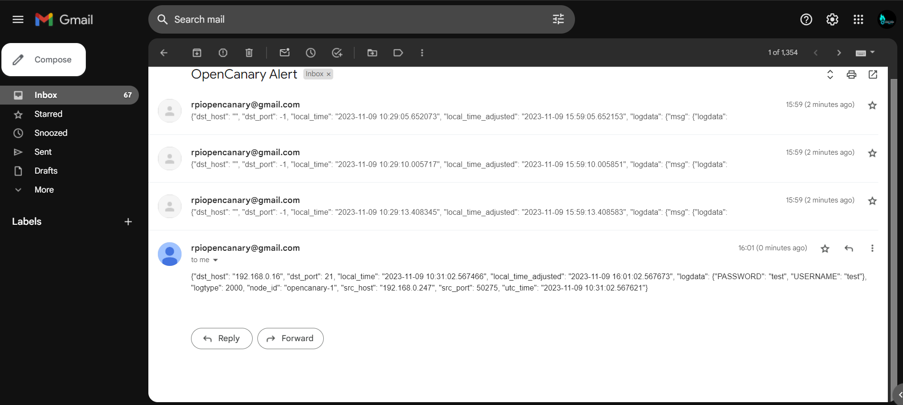

# Honeypot using Raspberry Pi & Opencanary.

**Table of Contents**

1. What is honeypot & opencanary?
2. Why companies use honeypot?
3. Advantages and disadvantages of honeypot.
4. Setting up Raspberry pi as honeypot.
5. Summary.

#### What is honeypot & opencanary?

**Honeypot:**

A honeypot is a security mechanism designed to deceive and detect unauthorized access or attacks on a network by simulating vulnerable systems or services. The primary purpose of a honeypot is to attract and trap attackers, allowing security professionals to study their tactics, techniques, and procedures (TTPs), as well as gather threat intelligence. Honeypots come in various forms, ranging from low-interaction honeypots, which simulate certain services without real system involvement, to high-interaction honeypots that emulate complete systems.

**OpenCanary:**

OpenCanary is an open-source honeypot framework that simplifies the deployment and configuration of honeypots. It is designed to mimic various services and protocols to attract potential attackers and log their activities. OpenCanary is written in Python and is customizable, allowing users to define the services they want to emulate and the types of events they want to log. It is widely used for research, threat detection, and gaining insights into the tactics used by attackers.

Key features of OpenCanary include:

1. **Customizable Services:**
   * OpenCanary allows users to emulate a variety of services, such as SSH, HTTP, SMB, and more. Users can configure which services to run based on their specific needs.
2. **Logging and Alerting:**
   * The framework logs various events and interactions, helping users analyze the behavior of potential attackers. It also supports alerting mechanisms, such as email notifications, to notify administrators of suspicious activities.
3. **Integration with SIEM Systems:**
   * OpenCanary can be integrated with Security Information and Event Management (SIEM) systems, allowing for centralized monitoring and analysis of honeypot data.
4. **Diverse Deployment Options:**
   * OpenCanary can be deployed on different platforms, including Raspberry Pi, making it accessible and cost-effective for various users.
5. **Community Support:**
   * Being open-source, OpenCanary benefits from a community of users and contributors who actively contribute to its development and share insights on threat intelligence.

#### Why companies use honeypot?

Companies use honeypots as strategic cybersecurity tools for a variety of reasons, each contributing to an overall enhancement of their security posture. Here are some key reasons why companies deploy honeypots:

1. **Early Threat Detection:**
   * **Purpose:** Honeypots serve as decoy systems designed to attract and detect unauthorized or malicious activity.
   * **Benefit:** Early detection allows companies to identify potential threats before they can impact critical systems, enabling faster response and mitigation.
2. **Understanding Attack Techniques:**
   * **Purpose:** Honeypots provide insights into the tactics, techniques, and procedures (TTPs) used by attackers.
   * **Benefit:** By studying attack techniques, companies can better understand the evolving threat landscape and adapt their security measures accordingly.
3. **Threat Intelligence Gathering:**
   * **Purpose:** Honeypots contribute to the collection of valuable threat intelligence data.
   * **Benefit:** This intelligence aids in the identification of emerging threats, helping companies make informed decisions about their cybersecurity strategies.
4. **Incident Response Preparation:**
   * **Purpose:** Honeypots offer a controlled environment for testing and refining incident response procedures.
   * **Benefit:** Regular simulation of attack scenarios enhances the preparedness of incident response teams, ensuring a more effective response to real-world incidents.
5. **Evaluation of Security Posture:**
   * **Purpose:** Companies use honeypots to assess the effectiveness of their existing security measures.
   * **Benefit:** Regular evaluations help identify vulnerabilities and weaknesses, allowing organizations to proactively address security gaps.
6. **Security Awareness and Training:**
   * **Purpose:** Honeypots can be used as educational tools for training security teams and raising awareness about potential threats.
   * **Benefit:** Security professionals gain hands-on experience in dealing with various types of attacks, enhancing their skills and readiness.
7. **Research and Collaboration:**
   * **Purpose:** Companies contribute to cybersecurity research and collaborate with the broader security community.
   * **Benefit:** Sharing findings from honeypot deployments can lead to the development of more effective defense strategies and the discovery of new threats.
8. **Strategic Deception:**
   * **Purpose:** Honeypots act as strategic elements of deception to mislead and divert attackers.
   * **Benefit:** Attackers may be lured into interacting with the honeypot, providing companies with an opportunity to observe and analyze their tactics.
9. **Legal and Ethical Deterrent:**
   * **Purpose:** The presence of honeypots can act as a legal and ethical deterrent to potential attackers.
   * **Benefit:** Knowing that a network has honeypots in place may discourage attackers, as they are more likely to be detected and face legal consequences.
10. **Compliance Requirements:**
    * **Purpose:** Some industries and regulatory frameworks may require organizations to implement specific cybersecurity measures.
    * **Benefit:** Deploying honeypots can help companies meet compliance requirements and demonstrate a commitment to robust cybersecurity practices.

#### Advantages and disadvantages of honeypot.

Honeypots are valuable tools in the field of cybersecurity, but like any technology, they come with their own set of advantages and disadvantages. Here's an overview:

#### Advantages of Honeypots:

1. **Early Threat Detection:**
   * **Advantage:** Honeypots allow for the early detection of potential threats and attacks because they are decoy systems designed to attract malicious activity.
   * **Use Case:** Organizations can identify and analyze new and evolving attack techniques before they reach critical systems.
2. **Insight into Attack Techniques:**
   * **Advantage:** Honeypots provide insight into the methods, tactics, and tools used by attackers.
   * **Use Case:** Security professionals can learn about the latest attack trends, helping them stay ahead in terms of cybersecurity awareness.
3. **Threat Intelligence Gathering:**
   * **Advantage:** Honeypots contribute to the collection of valuable threat intelligence, aiding in understanding the current threat landscape.
   * **Use Case:** This intelligence can be used to enhance security measures and create more effective defense strategies.
4. **Incident Response Preparation:**
   * **Advantage:** Honeypots offer a controlled environment for testing and refining incident response procedures.
   * **Use Case:** Organizations can improve their readiness to respond to real-world security incidents.
5. **Security Awareness and Training:**
   * **Advantage:** Honeypots can be used for training security teams and raising awareness about potential threats.
   * **Use Case:** Security professionals can gain hands-on experience in dealing with various types of attacks.
6. **Evaluation of Security Posture:**
   * **Advantage:** Organizations can use honeypots to assess the effectiveness of their existing security measures.
   * **Use Case:** Regular evaluations help in identifying and addressing vulnerabilities before they are exploited.
7. **Research and Collaboration:**
   * **Advantage:** Honeypots contribute to cybersecurity research and can foster collaboration within the security community.
   * **Use Case:** Findings from honeypot deployments can be shared to benefit the broader community.
8. **Budget-Friendly Cybersecurity Measures:**
   * **Advantage:** Honeypots, especially on platforms like Raspberry Pi, offer cost-effective cybersecurity measures.
   * **Use Case:** Small organizations or individuals with limited budgets can still implement effective security measures.

#### Disadvantages of Honeypots:

1. **Resource Intensive:**
   * **Disadvantage:** Honeypots can consume significant resources, both in terms of hardware and monitoring efforts.
   * **Consideration:** Organizations need to carefully manage resource allocation to avoid impacting production systems.
2. **False Positives:**
   * **Disadvantage:** Honeypots may generate false positives, triggering alerts for non-malicious activity.
   * **Mitigation:** Regular tuning and adjustment of honeypot configurations can help reduce false positives.
3. **Potential for Misuse:**
   * **Disadvantage:** Honeypots, if not secured properly, can become targets for attackers.
   * **Mitigation:** Isolation and strict access controls are crucial to prevent honeypots from being used as launchpads for attacks.
4. **Legal and Ethical Concerns:**
   * **Disadvantage:** The deployment of honeypots may raise legal and ethical concerns, especially if they interact with external systems.
   * **Consideration:** It's important to adhere to legal and ethical guidelines and disclose the presence of honeypots appropriately.
5. **Complexity of Management:**
   * **Disadvantage:** Managing and maintaining honeypots can be complex, especially for users with limited cybersecurity expertise.
   * **Consideration:** User-friendly honeypot solutions and clear documentation can help address this challenge.
6. **Limited Visibility:**
   * **Disadvantage:** Honeypots only provide information about attacks directed at them and may not offer a comprehensive view of the entire network.
   * **Consideration:** Supplement honeypot data with other security measures for a more holistic cybersecurity strategy.
7. **Time-Consuming:**
   * **Disadvantage:** Setting up and maintaining honeypots can be time-consuming.
   * **Consideration:** Organizations should weigh the benefits against the time investment and determine if it aligns with their security goals.

Understanding these advantages and disadvantages is crucial for making informed decisions about deploying honeypots and managing them effectively within a cybersecurity strategy.

#### Setting up Raspberry Pi as opencanary honeypot.

1. Setup Raspberry Pi.
2. Install & configure Opencanary on Raspberry Pi.
3. Configure auto start opencanary on boot.

_**Setup Raspberry Pi.**_

Before setting up the Raspberry Pi. Below is the list of tools we need in order to setup.

1. Raspberry Pi 4 ( 4 or higher is recommended but 3/3b will also work)
2. Raspberry Pi power supply
3. Micro SD card (16 GB or higher)
4. Ethernet cable (optional)

After gathering all the required tool we can setup the raspberry pi for opencanary. Below are the step-by-step instructions to set up a Raspberry Pi for OpenCanary:

1. Go to the official Raspberry Pi [website](https://www.raspberrypi.com/software/) and download the “**Raspberry Pi Imager**” tool according to your OS.

<figure><figcaption></figcaption></figure>

2. Install the raspberry pi Imager as normal software we install usually.

<figure><figcaption></figcaption></figure>

3. Open the Imager and give the administrative privileges and select raspberry pi board according to your raspberry pi version.

<figure><figcaption></figcaption></figure>

4. Next choose the OS Raspberry Pi OS Lite (64 bit).

<figure><figcaption></figcaption></figure>

**Note:** We are using Lite version means only CLI is available. If you want to access it through GUI use Full or normal 64 bit version. But you will need monitor, keyboard, mouse & connectors to access and use GUI.

5. Now insert the micro-SD card into your computer/laptop. Then select the choose storage and select your SD card properly.

<figure><figcaption></figcaption></figure>

6. After that it will ask for “Would you like to apply OS customization settings?” click on edit settings.

<figure><figcaption></figcaption></figure>

7. Enable the following options as shown in the picture and set the following things
   1. Username & password.
   2. Wi-Fi name(SSID) & password.
   3. Time zone & keyboard layout.

<figure><figcaption></figcaption></figure>

Now go to service tab, enable ssh and turn on “Use password authentication” option on as follows:

<figure><figcaption></figcaption></figure>

All the data on the micro SD card will be erased. So select the SD card carefully and take backup of micro SD card before proceeding

After that click on “**Yes”** on warning.

<figure><figcaption></figcaption></figure>

let it complete the flash. (could take 5-10 min depending on SD card read/write speed).

8.  After that insert the SD card in raspberry pi and boot (start) it. If you have monitor and keyboard setup the boot and open the terminal. And if you are following the steps given then search for IP address of raspberry pi in network through any network scanner or open the router dashboard and get the IP address of raspberry pi from there and run the following command to connect to it with command line.

    `ssh username@ip_address`

    Here username is which you given already before flashing SD card and IP address of raspberry pi.

<figure><figcaption></figcaption></figure>

If you are connecting for first time it will ask for “continue connecting?” then type `yes` and hit enter and enter the `password` you set in the previous step.

**Note:** If you didn’t set any password then the default username is `pi` and password is `raspberry`.

9.  Then execute the following command to update & upgrade system.

    `sudo apt update && sudo apt upgrade -y`

<figure><figcaption></figcaption></figure>

This will update all the packages to their latest version.

10. Execute the following command to install required packages for opencanary.

    `sudo apt install python3-dev python3-pip python3-virtualenv python3-venv python3-scapy libssl-dev libpcap-dev`

<figure><figcaption></figcaption></figure>

_**Install & configure Opencanary on Raspberry Pi.**_

1.  Execute the following command to install opencanary.

    `virtualenv env/`

    `. env/bin/activate`

    `pip install opencanary`

<figure><figcaption></figcaption></figure>

After that execute the following command to create a configuration file of opencanary

`opencanaryd --confing`

<figure><figcaption></figcaption></figure>

This will create a file name opencanary.conf in the /etc/opencanaryd/ directory.

2.  Now execute following command to edit that configuration file.

    `sudo nano /etc/opencanaryd/opencanary.conf`

<figure><figcaption></figcaption></figure>

The command will open the file in nano text editor. Here you can configure the honeypot configuration like what services should be on, on what port should they run etc.

<figure><figcaption></figcaption></figure>

3. Here set `“http.enabled” : true` to set fake http server on. Now press CTRL + S to save & CTRL + X to exit from nano.

<figure><figcaption></figcaption></figure>

4. Now we need to setup your mail in order to get alerts on email. Add the following lines in the configuration file “handlers” section as follows:

```json
"SMTP": {
"class": "logging.handlers.SMTPHandler",
"mailhost": ["smtp.gmail.com", 587],
"fromaddr": "noreply@yourdomain.com",
"toaddrs" : ["youraddress@gmail.com"],
"subject" : "OpenCanary Alert",
"credentials" : ["youraddress", "app password"],
"secure" : []
},
```

<figure><figcaption></figcaption></figure>

**Note:** Create a new sperate gmail for raspberry pi opencanary. As this is risky to set an main gmail as opencanary alert gmail. Because if attacker compromised the honeypot they can get access to your gmail.

Replace the following data before saving configuration:

1. “fromaddr” : set to your opencanary gmail.
2. “toaddrs” : set to gmail on which you want to receive alerts.
3. “credentials” : \[ “fromaddr”, “app password“]

here are the steps to get [app password](https://support.google.com/accounts/answer/185833).

**Note:** If you see the following error message while starting opencanary. Just open configuration file again and check if there is brackets or commas are missing and add them if missing.

<figure><figcaption></figcaption></figure>

5.  After this we will start our opencanary setup by using following command:

    `opencanaryd --start`

<figure><figcaption></figcaption></figure>

We can see in the log which services are started. To test it is working or not, try login through FTP with random username & password and see if you get alerts on your gmail with username & password.

6. Now test opencanary by trying to login through FTP with fake username and password. Opencanary will automatically send alerts on your gmail as follows:

<figure><figcaption></figcaption></figure>

_**Configure auto start opencanary on boot.**_

1.  Create a file using nano in `/etc/systemd/system` directory as following command and paste the data in it.

    `sudo nano /etc/systemd/system/opencanary.service`

```
Description=OpenCanary honeypot
After=syslog.target
After=network.target

[Service]
User=pi
Restart=no
Type=oneshot
RemainAfterExit=yes
Environment=VIRTUAL_ENV=/home/pi/env/
Environment=PATH=$VIRTUAL_ENV/bin:/usr/bin:$PATH
WorkingDirectory=/home/pi/env/bin
ExecStart=/home/pi/env/bin/opencanaryd --start

[Install]
WantedBy=multi-user.target
```

<figure><figcaption></figcaption></figure>

Now press CTRL + S to save & CTRL + X to exit from nano.

**Note:** If you want services like ssh, smb, etc. to be running fake then set the **`User=root`** to get the alerts on gmail or else it will not send any alerts regarding those services.

2. After saving file execute the following command to enable service on system boot & start the service to test.

1\. To enable service.

`sudo systemctl enable opencanary.service`

To check it is enabled or not execute the following command:

`sudo systemctl is-enabled opencanary.service`

<figure><figcaption></figcaption></figure>

2\. To start the service.

`sudo systemctl start opencanary.service`

To check it is started or not execute the following command:

`sudo systemctl status opencanary.service`

<figure><figcaption></figcaption></figure>

3. Now reboot the raspberry pi by using the command sudo reboot . And test the services which you started on opencanary by sending random inputs and see if you get alerts on gmail or not.

#### Summary:

In conclusion, using a Raspberry Pi as a honeypot with OpenCanary offers an economical and flexible solution for enhancing cybersecurity defenses. By emulating various services and attracting potential attackers, this setup provides early threat detection, valuable insights into attack techniques, and contributes to collaborative threat intelligence. The straightforward installation process, coupled with the versatility of Raspberry Pi, makes this approach accessible for both enthusiasts and small businesses. Monitoring OpenCanary logs allows users to gain a deeper understanding of the evolving threat landscape, while ethical deployment and compliance with legal considerations ensure responsible cybersecurity practices. Ultimately, deploying a Raspberry Pi as a honeypot using OpenCanary is an educational and effective strategy for bolstering overall security posture.
